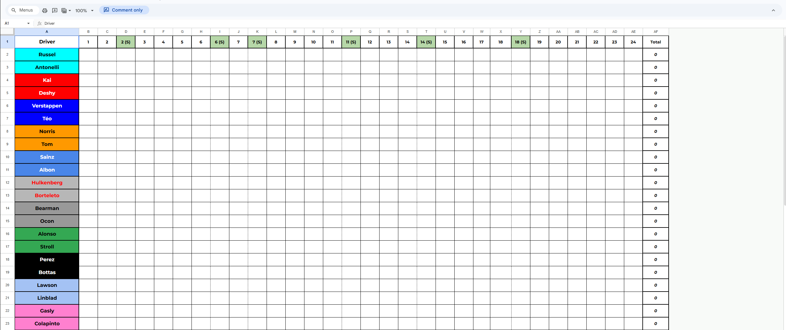

# Requirements
- Python 3.8+
- `pip install gspread google-auth pandas`
- A Google account to create the service account
- Editor access to the league Google Sheet

# Setup  

## 1. Go to Google Cloud Console
https://console.cloud.google.com

## 2. Create a project
Click the project dropdown at the top left (might say "Select a project")
Click New Project
Name it anything — f1-league works
Click Create

## Enable the APIs
In the search bar at the top type Google Sheets API → click it → click Enable [Top Result]
Search again for Google Drive API  and enable

## Create the Service Account
Search Service Accounts in the top bar → click it 
(or go back to the main projects page, by clicking Google Cloud on the top, and into IAM and Admin, on the left will be Service Account)
Name: f1-league-bot → click Create and Continue
Skip the optional role steps, just click Continue then Done

## Get the JSON key
You'll see your new service account listed, click on it
Go to the Keys tab
Click Add Key → Create New Key → JSON → Create
It auto-downloads a .json file — keep that safe

##  Share the sheet
Open the JSON file, find the "client_email" field — copy that address
Open the Google Sheet
Click Share
Paste that email, give it Editor access, click Send

## In Game
1. you will need to export the race results at the end of the race
2. copy the export (in Documents\My Games\F1 25\session results) nexto the script
3. run the script and then delete the csv file once the google sheet is updated

## Google Sheet Setup
The sheet should have the following structure on the "Race Stats" tab:
- Column A: Driver names (rows 2–23)
- Columns B–AE: One column per race/sprint (row 1 = headers)
- Column AF: Total points (auto-calculated by the script)
- A WCC standings table on the same tab (columns U–X, rows 27–37)

The script will handle all updates automatically once the sheet is shared 
with the service account email.

# Running the script
You'll be prompted for the CSV path and race number (e.g. `1`, `2`, `2S`).

### i've attached a image of our VSM google sheet setup

